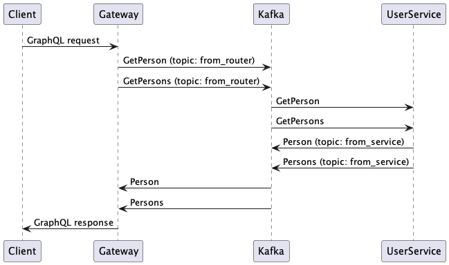

# Introduction

This repository holds examples of how to use the [Actix-Web](https://actix.rs/) web framework. For example:

- Serving a React App
- Providing REST APIs, including scope (e.g. `/v1/create-resource`, `/v2/list-resources`)
- Providing a GraphQL endpoint
- Providing a WebSocket endpoint (I copied this exactly from the example in the docs)

The `route-testing.http` file provides example API calls that you can click on to test the API routes, if you are using VS Code and the [REST Client](https://github.com/Huachao/vscode-restclient) extension. 

# Microservices architecture for the GraphQL query

The GraphQL query is handled using a microservices architecture as follows:

The gateway publishes messages to Kafka, and the UserService receives these messages from Kafka. One alternative is to use [Apollo Federation](https://www.apollographql.com/docs/federation/federation-2/new-in-federation-2/). The advantage of this solution is that the various microservices do not need to know about each other. The gateway doesn't need to know anything about the UserService - it just sends of a message and handles messages from Kafka. 

References:

- [Actix-Web](https://actix.rs/)
- [async-graphql](https://async-graphql.github.io/async-graphql/en/index.html)
- [Rust with GraphQL and Apollo federation](https://github.com/rkudryashov/graphql-rust-demo)
- [Serving static files](https://github.com/kilork/actix-web-static-files)
- [Polling a channel receiver for a limited duration](https://stackoverflow.com/questions/55168967/how-do-i-read-from-a-mpscchannel-for-a-specified-amount-of-time-without-unstab)
- [Kafka with Docker](https://www.baeldung.com/ops/kafka-docker-setup) and [creating the topics on start-up](https://stackoverflow.com/a/69534299/2251463)
- (Not used here) [Apollo Federation](https://www.apollographql.com/docs/federation/federation-2/new-in-federation-2/)

